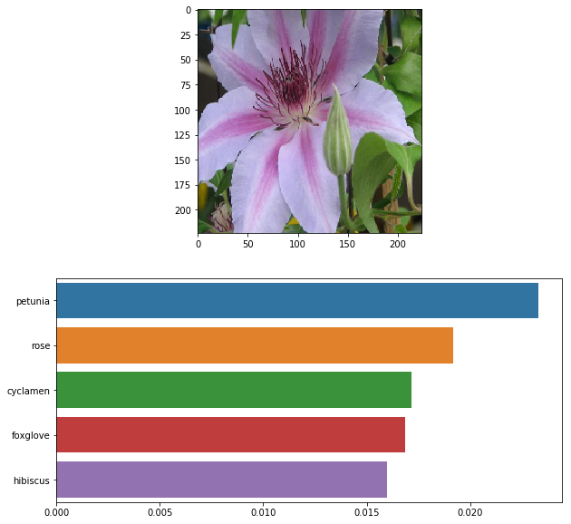

# Image Classifier

## Project description

In the project I've used Deep Learning to train image classifier to categorize images.

I've trained and tested it on a dataset of flowers as part of my graduation from [Udacity](https://www.udacity.com/) `Intro to machine Learning using PyTorch`.
One of the model applications could be that you point your smartphone on a flower and phone app will tell you what flower it is.
However, the model can be retrained on any dataset of your choice. You can learn it to recognize cars, point your picture on the car, and let the application to tell you what the make and model it is.

## Usage

1. Download [this dataset](http://www.robots.ox.ac.uk/~vgg/data/flowers/102/index.html) of 102 flower categories

2. Run `train.py' to train the model

- Basic usage: `python train.py data_directory`
- Options:
- Set directory to save checkpoints: `python train.py data_dir --save_dir save_directory`
- Choose architecture: `python train.py data_dir --arch "vgg13"`
- Set hyperparameters: `python train.py data_dir --learning_rate 0.01 --hidden_units 512 --epochs 20`
- Use GPU for training: `python train.py data_dir --gpu`

3. Run `predict.py` to classify your image

- Basic usage: `python predict.py /path/to/image checkpoint`
- Options:
- Return top K most likely classes: `python predict.py input checkpoint --top_k 3`
- Use a mapping of categories to real names: `python predict.py input checkpoint --category_names cat_to_name.json`
- Use GPU for inference: `python predict.py input checkpoint --gpu`

## Libraries used

Python 3

- pandas
- numpy
- torch
- torchvision
- matplotlib
- PIL

## Files in the repository

- `Image Classifier Project.ipynb.py`: Jupyter Notebook File containing the whole code
- `train.py`: contains functionality to retrain model for a dataset of your choice
- `predict.py`: contains functionality to classify an image
- `cat_to_name.json`: contains the mapping between image categories and their real name
